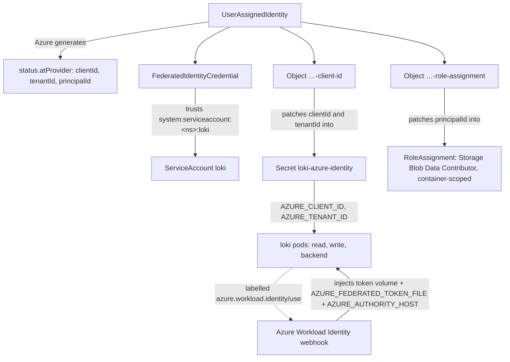

# Deploying on Azure

## Gather data
Find the 'Subscription name' (usually named after your installation) name and the 'Resource group' of your cluster (usually named after cluster id) inside your 'Azure subscription'
* list subscriptions:
```
az account list -otable
export SUBSCRIPTION_NAME="your subscription"
```
* list resource groups:
```
az group list --subscription "$SUBSCRIPTION_NAME" -otable
export RESOURCE_GROUP="your resource group"
```

## object storage setup
1. Create 'Storage Account' on Azure ([How-to](https://docs.microsoft.com/en-us/azure/storage/common/storage-account-create)) ['Create storage account'](https://portal.azure.com/#create/Microsoft.StorageAccount)
    * 'Account kind' should be 'BlobStorage'
    * Example with Azure CLI:
```
# Chose your storage account name
export STORAGE_ACCOUNT_NAME="loki$RESOURCE_GROUP"
# then create it
az storage account create \
     --subscription "$SUBSCRIPTION_NAME" \
     --name "$STORAGE_ACCOUNT_NAME" \
     --resource-group "$RESOURCE_GROUP" \
     --sku Standard_GRS \
     --encryption-services blob \
     --https-only true \
     --kind BlobStorage \
     --access-tier Hot
```
(It may be required to set the location using the `--location` flag.)

2. Create a 'Blob service' 'Container' in your storage account
    * Example on how to do it with Powershell in Azure portal:
```
export CONTAINER_NAME="$STORAGE_ACCOUNT_NAME"container
az storage container create \
     --subscription "$SUBSCRIPTION_NAME" \
     -n "$CONTAINER_NAME" \
     --public-access off \
     --account-name "$STORAGE_ACCOUNT_NAME"
```

3. Go to the 'Access keys' page of your 'Storage account'
    * Use the 'Storage account name' for `azure_storage.account_name`
    * Use the name of the 'Blob service' 'Container' for `azure_storage.blob_container_name`
    * Use one of the keys for `azure.storage_key`
    * With azure CLI
```
az storage account keys list \
     --subscription "$SUBSCRIPTION_NAME" \
     --account-name "$STORAGE_ACCOUNT_NAME" \
| jq -r '.[]|select(.keyName=="key1").value'
```

## Install the app

* Fill in the values from previous step in your config (`values.yaml`) file:
  * cluster ID
  * node pool ID
  * and your custom setup

* Install the app using your values.

## Using Azure Workload Identity instead of a storage account key

When the object storage is provisioned by Crossplane (`crossplane.azure.enabled: true`), Loki can authenticate to Blob storage with an Azure Workload Identity federated token instead of a static storage account key. This removes the long-lived secret and scopes blob access to Loki's ServiceAccount only.

**Prerequisites** (already present on Giant Swarm CAPZ management clusters):

* the [Azure Workload Identity webhook](https://github.com/giantswarm/azure-workload-identity-webhook-app) — required: it injects the projected federated token, `AZURE_FEDERATED_TOKEN_FILE` and `AZURE_AUTHORITY_HOST` into the loki pods (triggered by the `azure.workload.identity/use` pod label you set, see below);
* the cluster's OIDC issuer is exposed via the kube-apiserver `--service-account-issuer`;
* `provider-kubernetes` with an in-cluster `ProviderConfig` (used to copy the identity's generated client ID and principal ID into place, so the install is single-pass).

**Enable it** with:

```yaml
crossplane:
  azure:
    workloadIdentity:
      enabled: true
loki:
  loki:
    storage:
      azure:
        useFederatedToken: true  # and drop accountKey
```

plus the `loki.defaults.podLabels` / `loki.defaults.extraEnv` blocks that label the loki pods and pass the identity's `AZURE_CLIENT_ID`/`AZURE_TENANT_ID` — the complete configuration is in [`examples/values-capz-workload-identity.yaml`](../examples/values-capz-workload-identity.yaml). Those two blocks are deliberately *not* chart defaults: the webhook mutates every pod carrying `azure.workload.identity/use: "true"` on any cluster where it runs, whether or not Loki uses a federated token, so they must be set together with `workloadIdentity.enabled` (from shared-configs, for Giant Swarm installations). They are scoped to `defaults` rather than `global`/`loki.podLabels` so the gateway and memcached pods — which never talk to object storage — stay untouched.

The cluster's OIDC issuer is auto-detected from the kube-apiserver `--service-account-issuer` (read from `kube-system/kubeadm-config`), so no per-cluster value is needed. On a non-kubeadm cluster where auto-detection fails, set `crossplane.azure.workloadIdentity.oidcIssuerUrl` explicitly — on a reachable cluster an unresolvable issuer fails the release rather than silently skipping.

The feature is disabled by default and nothing is labelled or injected until you opt in, so existing storage-account-key deployments are unaffected.

### What gets created

With `crossplane.azure.workloadIdentity.enabled: true` the chart renders the following (names assume a blob container `giantswarm-<installation>-loki`, so the identity is named `giantswarm-<installation>-loki-identity`; the RBAC objects use the Helm release name):

| Resource | `kubectl get` kind | Example name | Purpose |
|----------|--------------------|--------------|---------|
| Managed identity | `userassignedidentity` (`managedidentity.azure.upbound.io`) | `giantswarm-<installation>-loki-identity` | The Azure User-Assigned Managed Identity. Azure generates its `clientId`, `tenantId` and `principalId` and exposes them on `status.atProvider`. |
| Federated credential | `federatedidentitycredential` (`managedidentity.azure.upbound.io`) | `giantswarm-<installation>-loki-identity` | Trusts tokens from the cluster OIDC issuer for subject `system:serviceaccount:<namespace>:loki`, letting the loki ServiceAccount federate into the identity. |
| Client-ID bridge | `object` (`kubernetes.crossplane.io`) | `giantswarm-<installation>-loki-identity-client-id` | Wraps the `loki-azure-identity` Secret and patches the identity's `clientId`/`tenantId` from `status.atProvider` into it. |
| Role-assignment bridge | `object` (`kubernetes.crossplane.io`) | `giantswarm-<installation>-loki-identity-role-assignment` | Wraps a `roleassignment` (`authorization.azure.upbound.io`) that grants the identity's `principalId` the `Storage Blob Data Contributor` role, scoped to the loki blob container. |
| Provider RBAC | `clusterrole` / `clusterrolebinding` | `<release>-crossplane-azure-identity` | Lets the in-cluster `provider-kubernetes` ServiceAccount manage the `roleassignment` and read the identity status. Kept on uninstall (`helm.sh/resource-policy: keep`); delete it by hand if you are removing the app for good. |
| Result Secret | `secret` | `loki-azure-identity` | Populated by the client-ID bridge; consumed by the loki pods as `AZURE_CLIENT_ID`/`AZURE_TENANT_ID`. |

The relationship between them (everything hangs off the managed identity, which is the only resource Azure assigns the generated IDs to):



To inspect a live install: `kubectl -n <namespace> get userassignedidentity,federatedidentitycredential,object,roleassignment`.

> **First enablement:** the managed identity's client ID is published to a Secret only after Crossplane reconciles it (~30s). Loki reads that Secret at startup and fails fast if it isn't there yet, so on the first rollout the loki pods may `CrashLoopBackOff` for up to a few minutes (CrashLoopBackOff backoff) until the identity is ready and the Secret is populated — then they recover on their own. No manual restart is needed.
